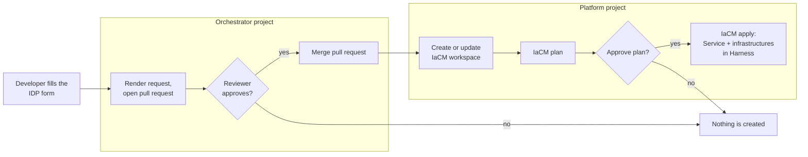

# Harness IDP service request

> **Status: work in progress.** This is a working proof of concept, shared early so others can try it, question it and help shape it. Names, file shapes and the pipeline will change. It is not an official Harness project.

A self-service way for a developer to ask for a new **Harness CD Service**, and the **Infrastructure Definitions** it deploys to, from a form in the Harness Internal Developer Portal (IDP). The request becomes plain YAML files in a pull request. After a reviewer approves, the files are merged and OpenTofu makes Harness match them.

Two service types are included today: **Google Cloud Run** and **Kubernetes Helm chart**. Adding a type means adding two template files, not writing new OpenTofu code.

## Contents

- [The idea](#the-idea)
- [How a request flows](#how-a-request-flows)
- [Repository layout](#repository-layout)
- [The pieces and how they are used](#the-pieces-and-how-they-are-used)
- [Prerequisites](#prerequisites)
- [Values you must replace](#values-you-must-replace)
- [Getting started](#getting-started)
- [Adding a service type](#adding-a-service-type)
- [Next steps](#next-steps)
- [References](#references)
- [Contributing](#contributing)

## The idea

The work is split between two owners.

| Who | Owns | How |
| --- | --- | --- |
| Platform team | The **project baseline**: the Harness project, its environments (for example `dev`, `staging`, `prod`) and its connectors (cloud, Git, cluster) | Out of scope here. Any project bootstrap works. |
| Developer | A **Service** and one **Infrastructure Definition per environment** for that Service | One IDP form. This repository. |

Design choices:

- **Git is the source of truth.** A request never calls the Harness API directly. It writes one YAML file per Service and one per Service and environment. Harness is then reconciled from those files.
- **One infrastructure per Service and environment.** The developer does not pick a shared infrastructure; the request creates the Service's own. Deleting a Service's files removes everything it owns.
- **A service type is a pair of templates.** `cloudrun` and `helm` are folders with a `service.tpl` and an `infrastructure.tpl`. The OpenTofu code does not know the types; it discovers them.
- **Works without IDP.** The form is one way in. The same files can be added by pull request and applied by the same workspace.
- **Review before anything exists.** The request opens a pull request and the run waits for an approval. Nothing is created in Harness until the files are merged and the plan is approved.
- **Two projects, two jobs.** An orchestrator project receives requests and only needs to write to Git. A platform project owns the IaCM workspaces and the token that creates resources. The pull request is the hand-over between them.

## How a request flows



1. **Form.** The developer picks the project and the service type, fills in the type's fields and adds one row per environment.
2. **Render.** The Service Request pipeline turns the form values into the module's request shape and runs a file-only OpenTofu apply. It writes the new YAML files and touches nothing in Harness.
3. **Pull request.** The files are pushed to a branch named `request/<org>/<project>/<service>` and a pull request is opened, using a short-lived GitHub App token.
4. **Review.** The run waits at a Harness approval that links to the pull request. No build machine runs while it waits.
5. **Merge.** After approval the pipeline merges the pull request, or accepts that a reviewer already merged it, and deletes the branch.
6. **Reconcile.** The run chains the Project Service Reconcile pipeline in the platform project. It creates the project's IaCM workspace if it is missing (one workspace, and so one state, per consumer project), then plans, waits for approval and applies.

The workspace never sees the request. It only reconciles what main records, so the reconcile pipeline can also be run on its own after a file is changed by hand.

## Repository layout

```
.
├── workflows/
│   └── request-service.yaml            IDP form (Workflow) that triggers Service Request
├── pipelines/
│   ├── service-request.yaml            Orchestrator project: render, pull request, approval, merge, chain reconcile
│   ├── project-service-reconcile.yaml  Platform project: workspace, plan, approve, apply. No request.
│   ├── project-service-bootstrap.yaml  Platform project: the direct path. Request as pipeline values, push to main, apply.
│   ├── inputsets/                      Input sets for the direct path
│   └── templates/
│       └── configure-workspace.yaml    Account-level stage template that creates the IaCM workspace
├── tofu/                               OpenTofu root the IaCM workspace runs
│   ├── main.tf, variables.tf, ...
│   ├── workspace.tfvars                Settings shared by every workspace run
│   ├── request.auto.tfvars.example     A local test request
│   ├── modules/
│   │   ├── harness-services/           Reads and writes service files, manages harness_platform_service
│   │   ├── harness-infrastructures/    Same for infrastructure files and harness_platform_infrastructure
│   │   └── templates/<type>/           service.tpl and infrastructure.tpl per service type
│   └── configs/                        The config files: the source of truth (example content)
└── workspace-bootstrap/                OpenTofu used by the stage template to create the workspace
```

## The pieces and how they are used

### Config files (`tofu/configs/`)

The files Harness is reconciled from, one tree per consumer project:

```
configs/organizations/<org>/projects/<project>/
├── services/<type>/<service_identifier>.yaml
└── infrastructures/<environment>/<service_identifier>.yaml
```

Each file holds a few fields the module reads (`name`, `tags`, the type) and the Harness YAML under `yaml:`. The files in this repository are example output for a Service called `orders_api`. They are written by the pipeline, and they can also be edited by hand.

### OpenTofu root and modules (`tofu/`)

- **`modules/harness-services`** finds every service file for the project, optionally renders new ones from a request, and declares one `harness_platform_service` per file.
- **`modules/harness-infrastructures`** does the same for infrastructure files and `harness_platform_infrastructure`.
- **`modules/templates/<type>/`** holds the two templates of a type. The folder name is the type name.
- **The root** wires both modules to a project folder and passes the request through.

A request is one variable, `services`, grouped by type:

```hcl
services = {
  cloudrun = {
    orders_api = {
      name  = "orders-api"
      owner = "group:account/orders"
      config = {                       # read by templates/cloudrun/service.tpl
        git = { connector_ref = "account.generic", repository = "orders", path = "deploy/service.yaml" }
      }
      infrastructure = {               # one entry per environment
        dev = { connector_ref = "gcpproject", project = "my-gcp-project-dev", region = "europe-west2" }
      }
    }
  }
}
```

Two behaviours matter:

- **Every existing file is always declared.** A file already in Git is passed through as it is; only a requested Service is rendered. Adding a second Service therefore never touches the first.
- **`write_files`** decides whether files are written to disk. It is `true` for the render step and for local runs, and `false` in the IaCM workspace (`workspace.tfvars`), where the files already come from Git.

Guards stop a run early with a clear message for an unknown type, an identifier used under two types, or a file whose content does not match its folder.

### Pipelines (`pipelines/`)

There are two ways in. Both end in the same files and the same workspace, so they can be mixed.

**The reviewed path: `service-request.yaml` and `project-service-reconcile.yaml`**

`Service Request` lives in the orchestrator project and is what the form triggers.

| Stage | What it does |
| --- | --- |
| **Serialize Project Requests** | A queue keyed by organization, project and Service. Different Services run in parallel, also while one waits for approval. |
| **Publish Request** | Fails if the requested Service already exists in the project (unless the run was started by hand with `allow_update = true`). Clones this repository, builds the request JSON from the pipeline variables with `jq`, runs a targeted, file-only `tofu apply` with a throwaway state, pushes a request branch and opens a pull request. |
| **Review Request** | A Harness approval whose message links to the pull request. Swap it for a Jira approval if that is where your reviews live. |
| **Merge Request** | Merges the pull request, or accepts a merge a reviewer already made, and deletes the branch. Fails if the pull request was closed unmerged. |
| **Reconcile Project** | Chains `Project Service Reconcile` in the platform project. |

Run it with `request_action = reconcile` to skip straight to the last stage and only reconcile a project.

`Project Service Reconcile` lives in the platform project, next to the IaCM workspaces. It carries no request: **Configure Project Workspace** uses the stage template to create or update the workspace `project_service_bootstrap_<org>_<project>`, pointing at `tofu/` on the main branch, and **Reconcile Project** runs IaCM init, plan, manual approval and apply. Harness does not allow a chained pipeline to chain another, so keep it a leaf.

The pull request is opened with an installation token of a GitHub App, made inside the step from the App's private key (a Harness file secret) and thrown away afterwards. No personal token is stored.

**The direct path: `project-service-bootstrap.yaml`**

One pipeline in the platform project that takes the request as pipeline values, pushes the rendered files straight to main, then configures the workspace and applies. It is the quickest way to try the module, and the input sets in `pipelines/inputsets/` drive it: plan only, apply only, and two example requests (one sends the infrastructure as a map, the other in the exact shape the form produces).

The `service_*` pipeline variables are the contract with the form in both paths: `service_config` is the JSON the service template reads, and `service_infrastructure` is either a map keyed by environment or the form's shape, the connector once plus a list of environment rows, which the render step converts to that map.

### Workspace stage template (`pipelines/templates/` and `workspace-bootstrap/`)

`Configure_Workspace_Custom_Template` is an account-level stage template. It clones this repository, runs the small OpenTofu root in `workspace-bootstrap/iacm-workspace`, shows a plan, asks for approval and creates or updates the IaCM workspace, including its variables, its variable file and its secret reference. Secrets are always passed as Harness secret references, never as values.

### IDP form (`workflows/request-service.yaml`)

A Harness IDP 2.0 Workflow. It lists real objects from the chosen project (environments, connectors and, for Cloud Run, the GCP projects the connector can see) and triggers the Service Request pipeline.

## Prerequisites

- A Harness account with **IDP**, **CD** and **IaCM**.
- A consumer project with its environments and connectors already created (the project baseline).
- An orchestrator project for `Service Request` and a platform project for the reconcile pipeline and the IaCM workspaces. One project can play both roles.
- A GitHub App installed on your copy of this repository with read and write access to contents and pull requests, and its private key stored as a Harness file secret. The same App can back your Git connector.
- A Git connector that can read and push to your copy of this repository.
- A Kubernetes connector for the step that runs the workspace bootstrap, and a container registry connector for the OpenTofu image.
- A Harness API token, stored as a Harness secret, that can manage Services, Infrastructure Definitions and IaCM workspaces. A second secret holds the token IDP uses to trigger the pipeline.
- Locally, only for testing: [OpenTofu](https://opentofu.org) 1.9 or newer.

## Values you must replace

The YAML files carry example values. Search and replace these before importing anything.

| Value in the files | What it is |
| --- | --- |
| `YOUR_ACCOUNT_ID` | Your Harness account id (in the workflow's URLs) |
| `harness_platform_accelerator` / `idp_orchestrator` | Organization and project that hold `Service Request` |
| `harness_platform_accelerator` / `platform_management` | Organization and project that hold the reconcile and bootstrap pipelines and the IaCM workspaces |
| `harness-landing-zone` / `harness-idp-service-request` | GitHub organization and repository name of your copy |
| `account.generic` | Git connector used to clone and push |
| `YOUR_GITHUB_APP_ID` / `YOUR_GITHUB_APP_INSTALLATION_ID` | The GitHub App that opens and merges pull requests |
| `account.github_app_private_key` | File secret holding that App's private key |
| `account.DockerHub` | Container registry connector |
| `my_k8s_runner` | Kubernetes connector that runs the workspace bootstrap step |
| `harness_platform_accelerator_platform_deployer_token` | Secret holding the Harness API token |
| `idp_workflow_runner_token` | Secret IDP uses to trigger the pipeline |
| `account.container_team` | User group that approves requests and workspace changes |
| `example_org` / `example_project`, `gcpproject`, `my-gcp-project-*` | Example consumer project, GCP connector and GCP project ids in the input sets and example config files |

## Getting started

**1. Try the module locally.** No Harness objects are created by the first command; it only writes files.

```bash
cd tofu
cp request.auto.tfvars.example request.auto.tfvars
export HARNESS_ACCOUNT_ID=... HARNESS_PLATFORM_API_KEY=...
export TF_VAR_organization_identifier=example_org TF_VAR_project_identifier=example_project
tofu init
tofu apply -target=module.harness_services.local_file.rendered -target=module.harness_infrastructures.local_file.rendered
```

A full `tofu plan` then shows the Services and Infrastructure Definitions that would be created in the project.

**2. Register the stage template** `pipelines/templates/configure-workspace.yaml` at account level.

**3. Try the direct path.** Create `pipelines/project-service-bootstrap.yaml` in the platform project and add the input sets. Run the plan input set first, then an example request.

**4. Add the reviewed path.** Create `pipelines/project-service-reconcile.yaml` in the platform project, then `pipelines/service-request.yaml` in the orchestrator project.

**5. Register the workflow** `workflows/request-service.yaml` in IDP and submit a request. The secret it names must hold a token that may execute pipelines in the orchestrator project.

## Adding a service type

1. Create `tofu/modules/templates/<type>/service.tpl` and `infrastructure.tpl`. Copy an existing pair and change the Harness YAML; the header comment of each template lists the values it reads.
2. Add the type to the `service_type` list in the form, with a branch for its fields. Give its list of environments its own field name.
3. Extend the two `| dump` expressions in the form's trigger step so the new type's values are sent.

## Next steps

Planned, roughly in this order. None of it is in the repository yet.

1. **A deployment pipeline with every Service.** The request also creates a pipeline in the consumer project that deploys the new Service. The pipeline adds no logic of its own: its stage comes from an account-level template chosen by the service type, for example a Cloud Run deploy template for `cloudrun` and a Kubernetes rolling, canary or blue-green template for `helm`. It follows the same pattern as Services and infrastructures: a `pipeline.tpl` per type, one YAML file per pipeline in Git, and a `harness-pipelines` module that declares `harness_platform_pipeline`. Because each Service's infrastructure carries the Service's identifier in every environment, the pipeline only asks for the environment at run time.
2. **Deploy from IDP.** A second workflow that lists the Services of a project and runs that pipeline, so a developer can request a Service and deploy it without leaving the portal.
3. **Add an environment to an existing Service**, as its own small request.
4. **Render and pull request as account-level templates**, so the orchestrator pipeline only references them and other teams can own the render for their request types.
5. **Config repository as a pipeline value**, so one orchestrator can serve several config repositories.
6. **Fewer approvals**: skip the plan approval when a plan only adds resources, or outside production projects. Optionally a Jira approval in place of the Harness one.
7. **Scope each infrastructure to its Service**, environment overrides, and an IDP catalog entry for every Service.
8. **Short-lived environments** through IDP Environment Blueprints, for previews that should not live in Git.

## References

Harness documentation:

- [Internal Developer Portal](https://developer.harness.io/internal-developer-portal) – Workflows, the `trigger:harness-custom-pipeline` action and dynamic pickers
- [IDP Environment Management](https://developer.harness.io/internal-developer-portal/use-idp/environment-management/overview) – Environment Blueprints, short-lived and long-lived environments
- [Continuous Delivery](https://developer.harness.io/continuous-delivery) – Services, environments, Infrastructure Definitions, Google Cloud Run and Helm deployments
- [Infrastructure as Code Management](https://developer.harness.io/infrastructure-as-code-management) – workspaces, workspace templates and the approval step
- [Platform: templates, pipeline chaining, approvals and triggers](https://developer.harness.io/platform)

Tools:

- [Harness Terraform provider](https://registry.terraform.io/providers/harness/harness/latest/docs) – `harness_platform_service`, `harness_platform_infrastructure`, `harness_platform_pipeline`, `harness_platform_workspace`
- [OpenTofu](https://opentofu.org/docs)
- [GitHub Apps: authenticating as an installation](https://docs.github.com/en/apps/creating-github-apps/authenticating-with-a-github-app/authenticating-as-a-github-app-installation) and the [pull requests API](https://docs.github.com/en/rest/pulls/pulls)

Community examples for IDP workflows:

- [harness-community/idp-samples](https://github.com/harness-community/idp-samples)
- [harness-community/IDP-tidbits-Creating-Dynamic-Workflows](https://github.com/harness-community/IDP-tidbits-Creating-Dynamic-Workflows)

## Contributing

Issues and pull requests are welcome, including ones that challenge the design. If you try this in your own account, the most useful feedback is where the setup steps were unclear and which values you had to change that are not in the table above.
