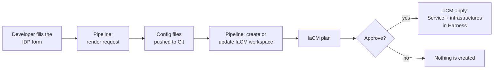

# Harness IDP service request

> **Status: work in progress.** This is a working proof of concept, shared early so others can try it, question it and help shape it. Names, file shapes and the pipeline will change. It is not an official Harness project.

A self-service way for a developer to ask for a new **Harness CD Service**, and the **Infrastructure Definitions** it deploys to, from a form in the Harness Internal Developer Portal (IDP). The request becomes plain YAML files in Git, and OpenTofu makes Harness match those files after a manual approval.

Two service types are included today: **Google Cloud Run** and **Kubernetes Helm chart**. Adding a type means adding two template files, not writing new OpenTofu code.

## Contents

- [The idea](#the-idea)
- [How a request flows](#how-a-request-flows)
- [Repository layout](#repository-layout)
- [The pieces and how they are used](#the-pieces-and-how-they-are-used)
- [Prerequisites](#prerequisites)
- [Values you must replace](#values-you-must-replace)
- [Getting started](#getting-started)
- [Adding a service type](#adding-a-service-type)
- [Known limits and roadmap](#known-limits-and-roadmap)
- [Contributing](#contributing)

## The idea

The work is split between two owners.

| Who | Owns | How |
| --- | --- | --- |
| Platform team | The **project baseline**: the Harness project, its environments (for example `dev`, `staging`, `prod`) and its connectors (cloud, Git, cluster) | Out of scope here. Any project bootstrap works. |
| Developer | A **Service** and one **Infrastructure Definition per environment** for that Service | One IDP form. This repository. |

Design choices:

- **Git is the source of truth.** A request never calls the Harness API directly. It writes one YAML file per Service and one per Service and environment. Harness is then reconciled from those files.
- **One infrastructure per Service and environment.** The developer does not pick a shared infrastructure; the request creates the Service's own. Deleting a Service's files removes everything it owns.
- **A service type is a pair of templates.** `cloudrun` and `helm` are folders with a `service.tpl` and an `infrastructure.tpl`. The OpenTofu code does not know the types; it discovers them.
- **Works without IDP.** The form is one way in. The same files can be added by pull request and applied by the same workspace.
- **Approval before apply.** Nothing is created in Harness until a person approves the plan.

## How a request flows



1. **Form.** The developer picks the project and the service type, fills in the type's fields and adds one row per environment.
2. **Render.** The pipeline turns the form values into the module's request shape and runs a file-only OpenTofu apply. It writes the new YAML files and touches nothing in Harness.
3. **Push.** The new or changed files are committed to the main branch.
4. **Workspace.** The pipeline creates the project's IaCM workspace if it is missing. There is one workspace, and so one state, per consumer project.
5. **Plan, approve, apply.** The workspace reads every config file for that project from Git and makes Harness match.

The workspace never sees the request. It only reconciles what Git records, so it can also be run on its own after a file is changed by pull request.

## Repository layout

```
.
├── workflows/
│   └── request-service.yaml            IDP form (Workflow) that triggers the pipeline
├── pipelines/
│   ├── project-service-bootstrap.yaml  The pipeline: render, push, workspace, plan, approve, apply
│   ├── inputsets/                      Input sets to run the pipeline without IDP
│   └── templates/
│       └── configure-workspace.yaml    Account-level stage template that creates the IaCM workspace
├── tofu/                               OpenTofu root the IaCM workspace runs
│   ├── main.tf, variables.tf, ...
│   ├── workspace.tfvars                Settings shared by every workspace run
│   ├── request.auto.tfvars.example     A local test request
│   ├── modules/
│   │   ├── harness-services/           Reads and writes service files, manages harness_platform_service
│   │   ├── harness-infrastructures/    Same for infrastructure files and harness_platform_infrastructure
│   │   └── templates/<type>/           service.tpl and infrastructure.tpl per service type
│   └── configs/                        The config files: the source of truth (example content)
└── workspace-bootstrap/                OpenTofu used by the stage template to create the workspace
```

## The pieces and how they are used

### Config files (`tofu/configs/`)

The files Harness is reconciled from, one tree per consumer project:

```
configs/organizations/<org>/projects/<project>/
├── services/<type>/<service_identifier>.yaml
└── infrastructures/<environment>/<service_identifier>.yaml
```

Each file holds a few fields the module reads (`name`, `tags`, the type) and the Harness YAML under `yaml:`. The files in this repository are example output for a Service called `orders_api`. They are written by the pipeline, and they can also be edited by hand.

### OpenTofu root and modules (`tofu/`)

- **`modules/harness-services`** finds every service file for the project, optionally renders new ones from a request, and declares one `harness_platform_service` per file.
- **`modules/harness-infrastructures`** does the same for infrastructure files and `harness_platform_infrastructure`.
- **`modules/templates/<type>/`** holds the two templates of a type. The folder name is the type name.
- **The root** wires both modules to a project folder and passes the request through.

A request is one variable, `services`, grouped by type:

```hcl
services = {
  cloudrun = {
    orders_api = {
      name  = "orders-api"
      owner = "group:account/orders"
      config = {                       # read by templates/cloudrun/service.tpl
        git = { connector_ref = "account.generic", repository = "orders", path = "deploy/service.yaml" }
      }
      infrastructure = {               # one entry per environment
        dev = { connector_ref = "gcpproject", project = "my-gcp-project-dev", region = "europe-west2" }
      }
    }
  }
}
```

Two behaviours matter:

- **Every existing file is always declared.** A file already in Git is passed through as it is; only a requested Service is rendered. Adding a second Service therefore never touches the first.
- **`write_files`** decides whether files are written to disk. It is `true` for the render step and for local runs, and `false` in the IaCM workspace (`workspace.tfvars`), where the files already come from Git.

Guards stop a run early with a clear message for an unknown type, an identifier used under two types, or a file whose content does not match its folder.

### Pipeline (`pipelines/project-service-bootstrap.yaml`)

| Stage | What it does |
| --- | --- |
| **Serialize Project Requests** | A queue keyed by organization and project. Requests for different projects run in parallel; requests for one project run one at a time. |
| **Publish Request** | Clones this repository, builds the request JSON from the pipeline variables with `jq`, runs a targeted, file-only `tofu apply` with a throwaway state, and pushes changed files. Skipped when no Service is requested. |
| **Configure Project Workspace** | Uses the stage template to create or update the IaCM workspace `project_service_bootstrap_<org>_<project>`, pointing at `tofu/` on the main branch. |
| **Reconcile Project** | IaCM init, plan, manual approval, apply. |

The pipeline variables are the contract with the form: `organization_identifier`, `project_identifier`, `tofu_action`, `request_service`, the `service_*` values, `service_config` (JSON read by the service template) and `service_infrastructure` (JSON, either a map keyed by environment or the form's list of rows, which the pipeline converts to that map).

### Input sets (`pipelines/inputsets/`)

Ways to run the pipeline without IDP: plan only, apply only (reconcile what Git records), and two example requests. One request sends the infrastructure as a map, the other sends it in the exact shape the form produces, which is useful for testing the translation step.

### Workspace stage template (`pipelines/templates/` and `workspace-bootstrap/`)

`Configure_Workspace_Custom_Template` is an account-level stage template. It clones this repository, runs the small OpenTofu root in `workspace-bootstrap/iacm-workspace`, shows a plan, asks for approval and creates or updates the IaCM workspace, including its variables, its variable file and its secret reference. Secrets are always passed as Harness secret references, never as values.

### IDP form (`workflows/request-service.yaml`)

A Harness IDP 2.0 Workflow. It lists real objects from the chosen project (environments, connectors and, for Cloud Run, the GCP projects the connector can see) and triggers the pipeline.

## Prerequisites

- A Harness account with **IDP**, **CD** and **IaCM**.
- A consumer project with its environments and connectors already created (the project baseline).
- A platform project to hold the pipeline.
- A Git connector that can read and push to your copy of this repository.
- A Kubernetes connector for the step that runs the workspace bootstrap, and a container registry connector for the OpenTofu image.
- A Harness API token, stored as a Harness secret, that can manage Services, Infrastructure Definitions and IaCM workspaces. A second secret holds the token IDP uses to trigger the pipeline.
- Locally, only for testing: [OpenTofu](https://opentofu.org) 1.9 or newer.

## Values you must replace

The YAML files carry example values. Search and replace these before importing anything.

| Value in the files | What it is |
| --- | --- |
| `YOUR_ACCOUNT_ID` | Your Harness account id (in the workflow's URLs) |
| `harness_platform_accelerator` / `platform_management` | Organization and project that hold the pipeline |
| `harness-landing-zone` / `harness-idp-service-request` | GitHub organization and repository name of your copy |
| `account.generic` | Git connector used to clone and push |
| `account.DockerHub` | Container registry connector |
| `my_k8s_runner` | Kubernetes connector that runs the workspace bootstrap step |
| `harness_platform_accelerator_platform_deployer_token` | Secret holding the Harness API token |
| `idp_workflow_runner_token` | Secret IDP uses to trigger the pipeline |
| `account.container_team` | User group that approves workspace changes |
| `example_org` / `example_project`, `gcpproject`, `my-gcp-project-*` | Example consumer project, GCP connector and GCP project ids in the input sets and example config files |

## Getting started

**1. Try the module locally.** No Harness objects are created by the first command; it only writes files.

```bash
cd tofu
cp request.auto.tfvars.example request.auto.tfvars
export HARNESS_ACCOUNT_ID=... HARNESS_PLATFORM_API_KEY=...
export TF_VAR_organization_identifier=example_org TF_VAR_project_identifier=example_project
tofu init
tofu apply -target=module.harness_services.local_file.rendered -target=module.harness_infrastructures.local_file.rendered
```

A full `tofu plan` then shows the Services and Infrastructure Definitions that would be created in the project.

**2. Register the stage template** `pipelines/templates/configure-workspace.yaml` at account level.

**3. Create the pipeline** from `pipelines/project-service-bootstrap.yaml` and add the input sets. Run the plan input set first, then an example request.

**4. Register the workflow** `workflows/request-service.yaml` in IDP and submit a request.

## Adding a service type

1. Create `tofu/modules/templates/<type>/service.tpl` and `infrastructure.tpl`. Copy an existing pair and change the Harness YAML; the header comment of each template lists the values it reads.
2. Add the type to the `service_type` list in the form, with a branch for its fields. Give its list of environments its own field name.
3. Extend the two `| dump` expressions in the form's trigger step so the new type's values are sent.

## Contributing

Issues and pull requests are welcome, including ones that challenge the design. If you try this in your own account, the most useful feedback is where the setup steps were unclear and which values you had to change that are not in the table above.
